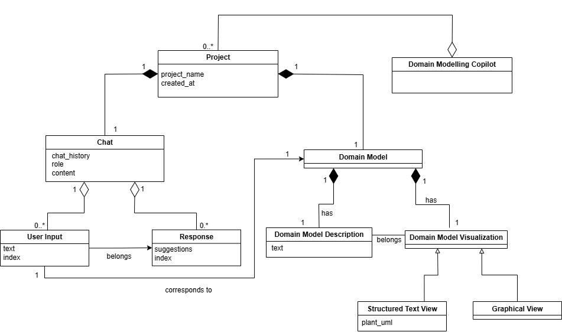
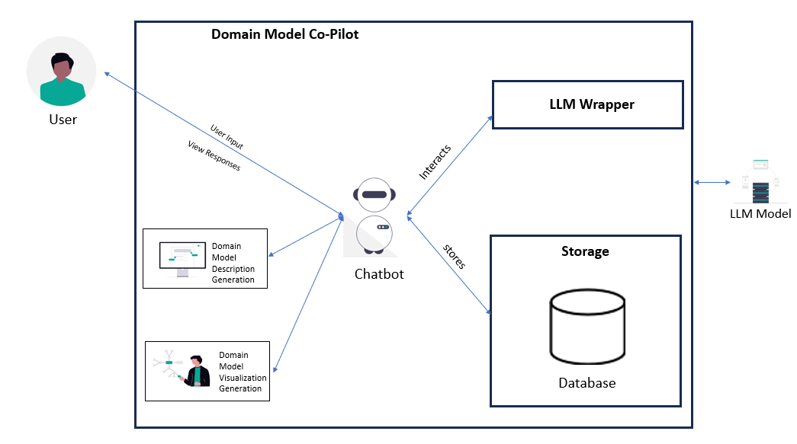
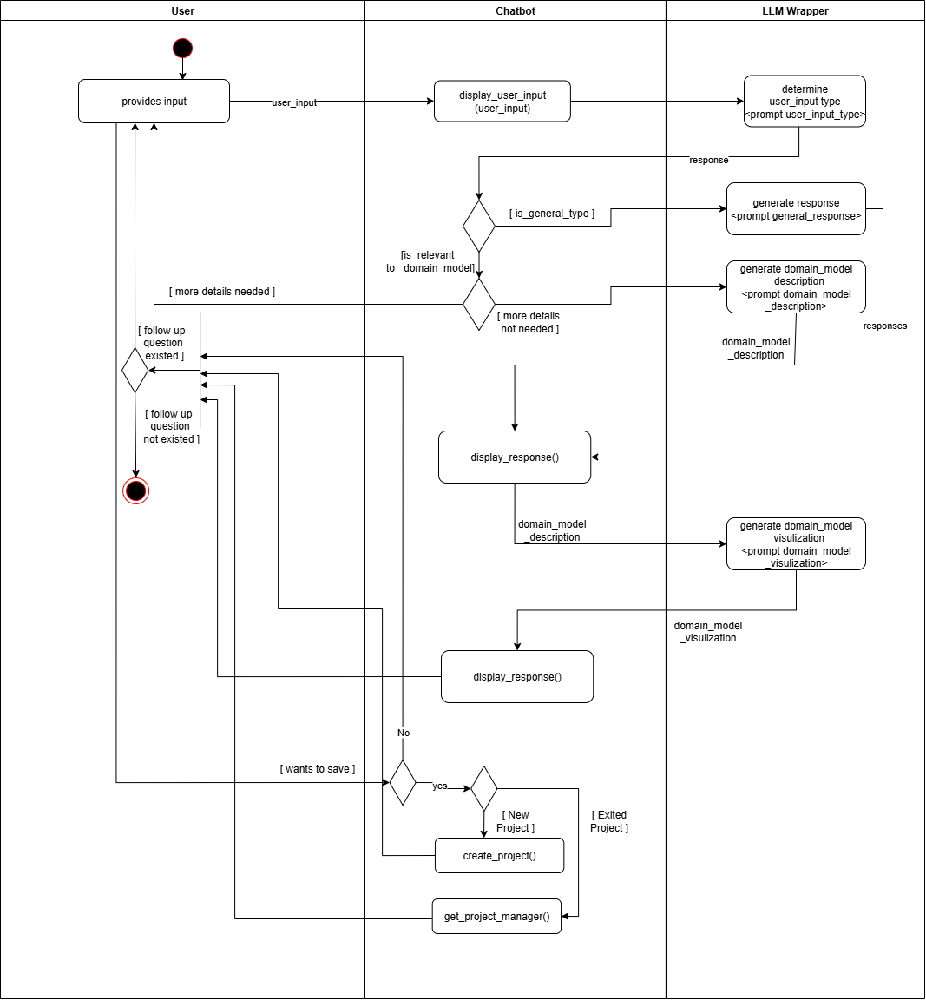

# Domain Modelling Copilot

**Domain Modelling Copilot** is an intelligent web-based assistant that revolutionizes how you create domain models from natural language descriptions. Simply describe your business ideas, software requirements, or system concepts in plain English, and watch as our AI-powered tool transforms them into professional domain models and UML diagrams automatically.

## Motivation

Domain modeling is a crucial skill in software engineering, but traditional approaches often require learning complex tools and manual diagram creation, which can be time-consuming and intimidating for students and professionals alike. This project addresses the gap between natural language requirements and structured domain models by leveraging AI technology. Our motivation is to democratize domain modeling by making it accessible through conversational interfaces, allowing users to focus on the conceptual aspects rather than technical tool mastery. This approach not only accelerates the learning process for students but also enhances productivity for experienced practitioners who need to quickly prototype and iterate on domain models.


## Features

### **Smart Chat Assistant**
- **Talk Naturally** - Simply describe your project ideas in everyday language through a chat interface
- **Helpful Suggestions** - The system guides you by asking questions when your description needs more details

### **Automatic Diagram Creation**
- **Instant Models** - Turn your written descriptions into professional business models automatically
- **Visual Diagrams** - Generate clear, easy-to-read diagrams that show how your system works

### **Easy Editing**
- **Change Anything** - Add, remove, or modify parts of your model with simple Inputs.
- **Safety Checks** - The system asks for confirmation before deleting important parts to prevent mistakes.

### **Version Control**
- **Never Lose Work** - Every change is automatically saved as a new version of your project
- **Easy Undo** - Go back to any previous version with one click if you don't like the changes

### **Data Storage**
- **Always Available** - Your projects are safely stored and available whenever you come back
- **Multiple Projects** - Work on several different projects at the same time without mixing them up

---

## System Architecture & Design

### Domain Model


*The domain model illustrating the core entities, relationships, and business logic of the Domain Modelling Copilot system.*

### Context Diagram


*System context showing external entities and their interactions with the Domain Modelling Copilot.*

### Activity Diagram


*Activity flow diagram depicting the complete user workflow from requirement input to domain model generation.*


## Tech Stack

- **Python 3.9+**
- **Flask** (Web Framework)
- **OpenAI API** (Natural Language Processing)
- **MongoDB** (Database & Version Control)
- **PlantUML** (Diagram Generation)
- **dotenv** (Environment Configuration)
- **pytest** (Testing Framework)

---

### Project Structure (MVC Architecture)
```
domain-modelling-copilot/
├── .env                        # Environment variables (API keys, DB config)
├── .gitignore                  # Git ignore rules
├── README.md                   # Project documentation
├── requirements.txt            # Python dependencies
├── run.py                      # Application entry point
│
├── src/                        # Source code directory
│   ├── app.py                  # Main Flask application with routes
│   │
│   ├── controller/             # Request handlers and route logic
│   │   ├── __init__.py
│   │   ├── chat_controller.py  # Chat and UML generation endpoints
│   │   └── project_controller.py # Project management endpoints
│   │
│   ├── model/                  # Business logic and data models
│   │   ├── __init__.py
│   │   ├── chat_history.py     # Chat message storage and management
│   │   ├── domain_model_description.py # Domain model text representation
│   │   ├── gpt2.py             # OpenAI integration and PlantUML generation
│   │   ├── llm_service.py      # Language model orchestration service
│   │   ├── openai_client.py    # OpenAI API client configuration
│   │   └── project_service.py  # MongoDB operations and version control
│   │
│   └── view/                   # Frontend templates and static assets
│       ├── templates/
│       │   └── index.html      # Main application interface
│       └── static/
│           ├── css/
│           │   └── style.css   # Application styling
│           └── js/
│               ├── app-controller.js # Main application logic
│               ├── chat-view.js     # Chat interface management
│               ├── project-view.js  # Project selection and management
│               ├── uml-view.js      # UML diagram rendering
│               └── main.js          # Application initialization
│
└── tests/                      # Test suite
    └── __init__.py
```

---

## Getting Started

### Prerequisites

Before running the application, ensure you have the following installed:

#### 1. Check Python Installation
```bash
python --version
```
**Required:** Python 3.9 or higher

If Python is not installed or the version is below 3.9:
- **Windows:** Download from [python.org](https://www.python.org/downloads/)
- **macOS:** Use Homebrew: `brew install python@3.9`
- **Linux:** Use your package manager: `sudo apt install python3.9`

#### 2. Verify and upgrade pip installation
```bash
pip --version
```

**Upgrade pip to the latest version:**
```bash
python -m pip install --upgrade pip
```

#### 3. Install MongoDB
**Required:** MongoDB for data storage and version control

- **Windows:** Download from [MongoDB Download Center](https://www.mongodb.com/try/download/community)
- **macOS:** Use Homebrew: `brew install mongodb-community`
- **Linux:** Follow the [MongoDB Installation Guide](https://docs.mongodb.com/manual/installation/)

**Start MongoDB Server:**
```bash
mongod
```

### Installation Steps

### 1. Clone the repository

```bash
git clone https://github.com/VasiliySeibert/domain-modelling-copilot.git
cd domain-modelling-copilot
```

### 2. Create and activate a virtual environment (Recommended)
```bash
python -m venv venv
# On Windows:
venv\Scripts\activate
# On macOS/Linux:
source venv/bin/activate
```

> **Note:** Virtual environment is recommended but not required. It helps isolate project dependencies from your system Python installation. If you prefer to install packages globally, you can skip this step.
### 3. Install the dependencies
```bash
pip install -r requirements.txt
```

### 4. Set up MongoDB Database
1. **Open MongoDB Compass** (or your preferred MongoDB client)
2. **Click "Connect"** or "New Connection"
3. **Enter Connection String:**
   ```
   mongodb://localhost:27017
   ```
4. **Create Database:** Create a new database named `DMC` (Domain Modelling Copilot) or any name you prefer
5. **Update .env file** if you chose a different database name:
   ```env
   MONGODB_URI="mongodb://localhost:27017/your_database_name"
   ```

### 5. Configure OpenAI API Key
Update the `.env` file in the root directory with your OpenAI API key:

```env
GPT_MODEL="gpt-4o-mini"
OPENAI_API_KEY="your_openai_api_key_here"
MONGODB_URI="mongodb://localhost:27017/"
```

Replace `"your_openai_api_key_here"` with your actual OpenAI API key.

### 5. Run the application
```bash
python run.py
```
Visit: [http://localhost:5000](http://localhost:5000)

---


## Usage

1. **Access the Application:** Open your browser and navigate to `http://localhost:5000`

2. **Input Scenarios:** Enter natural language descriptions of your domain scenarios in the chat interface. Be descriptive and include:
   - **Business Context:** What kind of system or business you're modeling
   - **Key Entities:** Main objects, people, or concepts in your domain
   - **Relationships:** How different entities interact with each other
   - **Business Rules:** Important constraints or processes
   
   **Example Scenarios:**
   ```
   "I want to model an online bookstore system where customers can browse books, 
   add them to cart, place orders, and make payments. The system should track 
   inventory, manage customer accounts, and handle order fulfillment."
   ```
   
   ```
   "Create a domain model for a university course registration system. Students 
   can enroll in courses, professors teach courses, and courses have prerequisites. 
   The system tracks grades, schedules, and student progress."
   ```

3. **Interact with AI Assistant:** If your description needs more details, the system will ask follow-up questions like:
   - "What types of users will interact with this system?"
   - "How do customers make payments?"
   - "What information should be stored about each entity?"

4. **Generate Models:** Once you provide sufficient information, the system will automatically:
   - Create a natural language description of your domain model
   - Generate a visual domain model diagram
   - Produce PlantUML diagrams for technical documentation

5. **View and Edit Results:** 
   - Review the generated domain model description
   - Examine the visual diagrams
   - Make changes by chatting: "Add a discount system" or "Remove the inventory tracking"

6. **Version Control & Saving:** 
   - **Automatic Saving:** All changes are automatically saved as new versions in MongoDB
   - **Undo Changes:** Click the "Undo" button to revert to the previous version before saving your project
   - **Multiple Projects:** Work on several different projects simultaneously with complete version history

---


## Acknowledgments

This university project was developed under the supervision of Prof. Andreas Rausch as part of the Masters in Digital Technologies program. We would like to acknowledge the guidance and support provided throughout the development process.

### Development Team
- **Product Owner:** Vasiliy Seibert
- **Developers:** 
  - Darshan Shah - https://github.com/DarshanScripts
  - Meet Chavda - https://github.com/meetchavda06s
  - Mitbhai Chauhan -https://github.com/Mitchauhan0712
  - Pratham Rathod - https://github.com/PrathamRathod14
